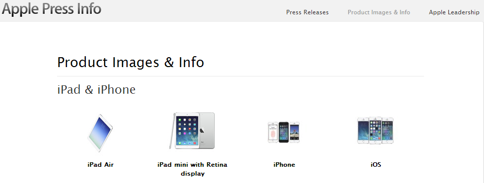

#Дополнительные материалы

Пиарщики всегда хотят дать журналисту все, что у них есть. Поэтому каждый второй пресс-релиз приходит с прикрепленными файлами.

Основное правило общения - быть полезным друг другу. К сожалению, файлы эти не всегда нужны журналисту. Поговорим об этике использования аттачей в общении со СМИ.

И начнем, конечно, с размера файлов.

#Размер материалов

Ниже - характерное приглашение на пресс-конференцию с двумя приложениями.

Обратите внимание на трехмегабайтный файл с характерным для цифрового фотоаппарата названием.

Давайте взглянем на то, как он выглядит.

Использовать такое изображение для иллюстрирования сообщения практически нереально - оно плохо снято, поверху пущена надпись, а св нижнем правом углу еще и стоит эмблема НСН.

Вторая картинка - схема проезда - изображает карту Яндекса. Нет ни одной причины, по которой нельзя было бы заменить такое изображение ссылкой на те же Яндекс.Карты, как это делают все в рунете.

##Оформление документов

Вашими материалами может воспользоваться кто угодно. Поэтому, пожалуйста, постарайтесь не оставлять, в файлах Word истории правок, а также имен авторов текста. Например, здесь имя автора - лишнее.

Старайтесь также давать понятные названия вашим приложениям. Журналист, возможно, сохранит их и потом не сможет найти. А, возможно, он на пару минут зависнет, пытаясь среди нескольких файлов найти нужный. 

##Количество материалов

В идеале приложенных файлов не должно быть вообще. Журналист должен получить всю важную информацию из письма, а любые дополнения - перейдя по указанным в письме ссылкам.

Но это в идеале. Обычно вполне достаточно 

##Сообщения с качественными картинками

Конечно, изображения в высоком разрешении нужны. Но правильнее не цеплять их к письму, а выкладывать на сайт или сразу в облако. Вот как делает это российская пресс-служба Toshiba.

Совсем правильно давать ссылку на специальный раздел с изображениями и материалами на сайте. Вот, например, как выглядит [такой раздел](http://www.apple.com/pr/products/ "Раздел Product Images & Info") на сайте Apple.

На таком сайте собраны архивы с изображениями, пресс-релизы, касающиеся конкретных продуктов, ссылки на сайты отдельных продуктов, контакты пресс-службы и, конечно, краткая характеристика товара. То есть, все то, что пригодится журналисту, но никогда не влезет в ваше письмо.

