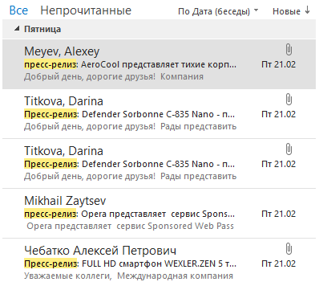
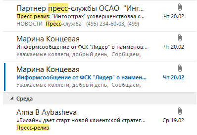
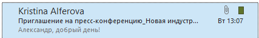
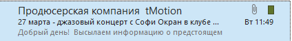
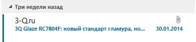
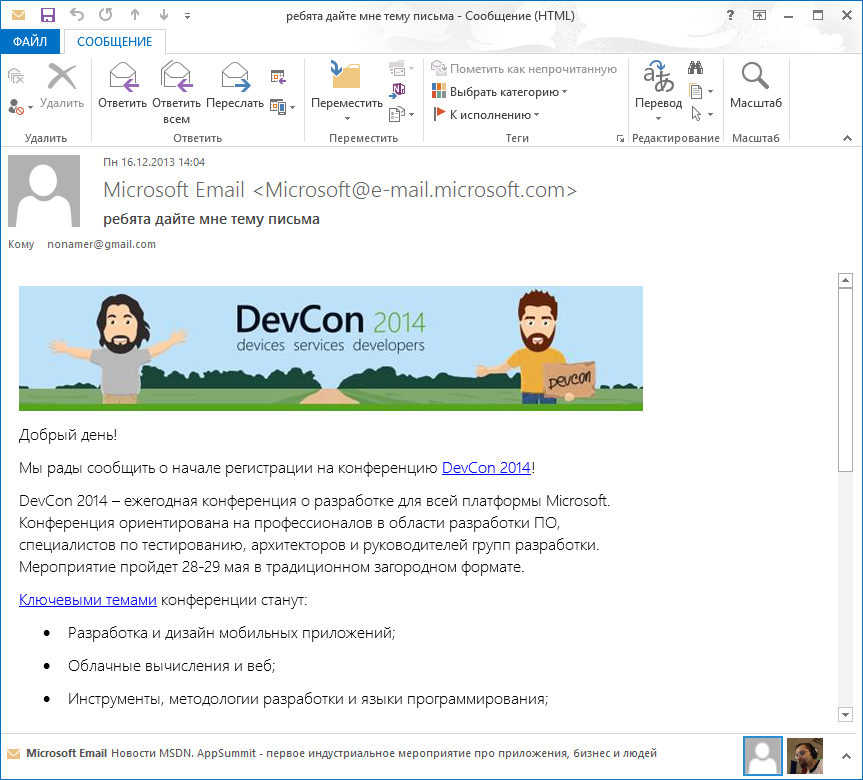
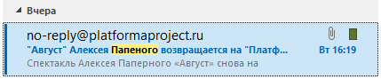

#Заголовок пресс-релиза

Хороший пресс-релиз должен достичь трех целей. 

1. Релиз надо доставить нужному адресату;
2. Адресат должен прочесть пресс-релиз;
3. Адресат должен отреагировать нужным образом.

Выполнение одной цели невозможно без предыдущей. Адресат не может отреагировать, не прочтя письма. Решение же прочесть пресс-релиз журналист принимает, исходя из авторства отправителя и темы письма. 

Так на первый план выходит заголовок пресс-релиза – от него зависит, заинтересуется ли журналист содержимым сообщения.

В силу того, что в современном мире используется множество почтовых платформ, предугадать, какой пользуется адресат, невозможно. Это может быть Gmail (или Google Apps), Office 365 (Outlook.com, Outlook), любые мобильные почтовики, а также самые экзотические настольные почтовые клиенты. Поэтому мы не можем предугадать, какую часть заголовка прочтет журналист.

Более-менее с уверенностью мы можем сказать, что получатель увидит наше имя, около пяти первых слов заголовка и первые слова письма. 

Так заголовок письма, который может и не совпадать с пресс-релизом, становится чуть ли не самым важным элементом нашего сообщения.

Необходимо также добавить – физиологически читатель просматривает список сообщений, выхватывая первые 2-3 слова из заголовка. Это значит, что именно первые слова должны привлечь внимание, оказаться самыми информативными. Это не только дает мини-сообщение, но и помогает дальнейшей работе с пресс-релизом: журналисту может понадобиться найти ваше письмо позже. Как это произойдет, если он точно не помнит даже фамилии вашего спикера?

Специалисты по юзабилити [рекомендуют](http://www.nngroup.com/articles/email-subject-lines/) сконцентрировать весь смысл в первых 40 символах темы письма.

Поэтому, хотя привлечь внимание можно самыми разными способами, выбирать надо с умом. Например, мы можем поставить в начале (а то и в конце) кучу восклицательных знаков – но что запомнит читатель, если ему понадобится этот пресс-релиз? Вот характерный пример:

**!!!Материалы пресс-конференции ЗМО Н.А.Панкова в интерфаксе 6.12.13!!!!**

Кроме того, здесь пресс-служба попадает в ловушку, касающуюся реализации собственной PR-стратегии. В идеале сообщения, доставленные по одному и тому же каналу распространения, должны быть оформлены единообразно. Восклицательные знаки сработают раз, два, но визитной карточкой вашей компании им лучше не быть.

Поговорим немного об этом единообразии. Нам важно сообщить получателю следующее:

1. Он видит пресс-релиз;
2. Пресс-релиз от нашей компании;
3. Сообщение о том-то и том-то.

Другими словами, мы обеспечиваем поддержку принятия решения журналиста – открыть или не открыть, читать или не читать, отложить или нет.

Вот, например, заголовки писем с пресс-релизами Яндекса:

**Яндекс объявляет финансовые результаты за IV квартал 2013 года и 2013 год**

**Яндекс запускает Кита**

**Яндекс выпустил приложение для болельщиков**

**Яндекс приглашает на «Зимние Игры — 2014»**

Обратите внимание на то, что основное сообщение всегда помещается в 5-6 первых слов, а заголовок письма начинается с названия компании. Кроме того, каждый релиз Яндекса отправлен от контакта «Яндекс» с адресом pr@yandex.ru. Даже если виден только адрес, можно четко понять от кого пришло сообщение. «Яндекс» вместо имени – тоже хорошая практика. PR-менеджеры приходят и уходят, и, несмотря на то, что кнопку рассылки нажимают они, сообщения исходят от компании в целом. Лучше указать контактные данные менеджера, занимающегося данным информационным поводом, в конце релиза.

И, если уж начистоту, то при коммуникациях, которые не содержат пресс-релиза, вовсе не обязательно дублировать информацию об отправители в теме письма. И так понятно, что если письмо от Яндекса, то и главное действующее лицо - та же компания. Подчеркну - это особенно хорошо работает, если вы транслируете в теме письма не заголовок релиза, а другое сообщение, которое не обязательно должно начинаться с названия компании. Например, если вы приглашаете человека на мероприятие, проактивно обращаетесь к нему или задаете вопрос.

Ассоциация коммуникационных агентств России (АКАР) более явно указывает на формат сообщения и то, что это информация для журналистов, добавляя префикс [smi] в начале заголовка.

**[smi] АКАР_Рейтинг кафедр российских ВУЗов, готовящих специалистов в сфере Рекламы**

**[smi] Приглашение на пресс-конференцию АКАР. Объемы рекламы. Итоги года 2013.**

Пресс-служба компании Defender, продающей компьютерные и офисные аксессуары, начинает заголовок своих сообщений более стандартным «Пресс-релиз:» и по возможности (и в силу характера информационных поводов) указывает название устройства, о котором идет речь.

**пресс-релиз: AeroCool представляет тихие корпусные вентиляторы Lightning с подсветкой**

Точно так же оформляются релизы производителя электроники Wexler:

**Пресс-релиз: FULL HD смартфон WEXLER.ZEN 5 теперь в белом цвете!**

Естественно, любую из этих рекомендаций можно нарушить. Нет никаких обязательных требований, касающихся представления как бренда, так и индикатора релиза в заголовке письма. Вот несколько заголовков из релизов Opera Software.

**Выручка Opera Software в 3 квартале 2013г. выросла на 34% в годовом исчислении до 75,5 млн долларов**

**Количество российских пользователей браузера Opera для Android за квартал выросло на 19,7%**

**Браузер Coast от Opera за два дня вошел в десятку самых популярных приложений российского App Store**

**пресс-релиз: Opera представляет  сервис Sponsored Web Pass для бесплатного доступа в интернет**

**пресс-релиз: Более трети всего видео, передаваемого через сети 3G в России, «зависает» при просмотре**

Просто будьте готовы к тому, что 

**Пресс-релиз: "Ингосстрах" усовершенствовал систему обработки договоров добровольного автострахования** 

в почтовике журналиста превратится в **Пресс-релиз: "Ингосстрах" усовершенствовал…**

 А

**«Билайн» дает старт новой клиентской стратегии и объявляет о новой политике контроля оказания услуг контент-провайдерами** в **«”Билайн” дает старт новой клиентской стратег…»**

Поэтому даже словосочетание, которым вы даете понять адресату, что он читает пресс-релиз, надо выбирать с умом. Вот пример:

**Сообщение для СМИ: Состоялось открытие первого в России семейного агротуристического комплекса**

Журналисты увидят в лучшем случае:

**Сообщение для СМИ: Состоялось открытие первого**

То же касается другой важной части работы пиарщика: приглашений на мероприятия. Желательно оформлять их таким образом, чтобы адресат понимал, о чем именно идет речь. Даже если вы общаетесь с ним сравнительно часто, он может забыть не только вас, но и ваш бренд.

Гораздо лучше выглядит

Надо очень осторожно подбирать слова. В заголовке пресс-релиза не всегда уместны оценочные суждения, так как журналисту они не дают никакой информации. Это снижает интерес к сообщению. Характерные примеры:

**3Q Glaze RC7804F: новый стандарт гламура, новый рекорд толщины**

из которого в почте видно: **«3Q Glaze RC7804F: новый стандарт гламура, но…»** 

Вообще информативность заголовка играет центральную, ключевую роль при распространении пресс-релиза. Если заголовок не содержит новостного повода, не сообщает ничего нового, изобилует казёнными оборотами – вряд ли задачи пресс-службы будут выполнены.

**Компания ABPG осуществляет техническое обеспечение мероприятий любой сложности**

Особенно важно следить за происходящим на пространстве информационного сообщения. Повод – это всегда действие. Часто мы можем улучшить заголовок глаголом, но это не обязательно. Если мы пишем в заголовке «Финансовые результаты за 2013 год», адресат понимает, что мы их выпустили или объявили. Но вот пример, когда действие не подбирается (про этот пресс-релиз мы еще вспомним в следующих главах, пока здесь приводится только заголовок):

**Шедевры мировой литературы на сайте mybookezzz.org**

Что хотел сказать автор? Что шедевры существуют уже давно? Что их выложили? Или что появился такой сайт? У журналиста не так много времени на оценку информационных поводов – почти наверняка такой заголовок не привлечет его внимания.

Не стоит увлекаться и простым перечислением ключевых слов, даже если вы предполагаете, будто адресат хорошо знает, о чем речь.

**Статья Форум_Межкультурный диалог_Голицыно**

Здесь каждое слово таит тайну. О чем статья? Что за Голицыно? Какие культуры вступили в диалог? Да и полноте, статья это или пресс-релиз? При изучении, конечно, оказывается – пресс-релиз с просьбой разместить на сайте.

Никогда не используйте автоподстановку имен в заголовке письма. Во-первых, читатель обязательно заметит неискренность и станет хуже к вам относиться. Во-вторых, те же юзабилисты утверждают, что ничего кроме подозрений такая вежливость не вызывает.

##Краткое содержание
Взгляните еще раз на скриншоты выше. Обратите внимание на тот кусочек письма, который показывает почтовик. Он мог бы содержать полезную информацию, но в большинстве случаев не содержит.

При опредленной фантазии вы найдете способ задействовать первые две строки вашего письма в качестве дополнительного источника информации. 

И наоборот, если фантазию развернуть не туда, получится тавтология в квадрате.

##Перед отправкой

Никогда не забывайте перечитать заголовок письма перед отправкой. Иначе произойдет неприятность вроде той, с которой столкнулась российская Microsoft в декабре 2013 года, рассылавшая сообщение о начале регистрации на конференцию DevCon 2014.

Даже кажущийся правильно написанным заголовок обязательно надо перечитать.

