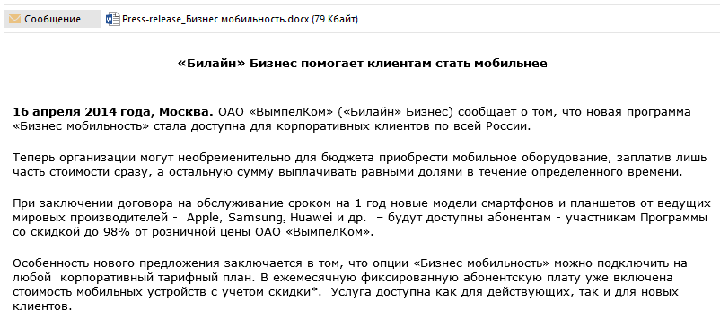
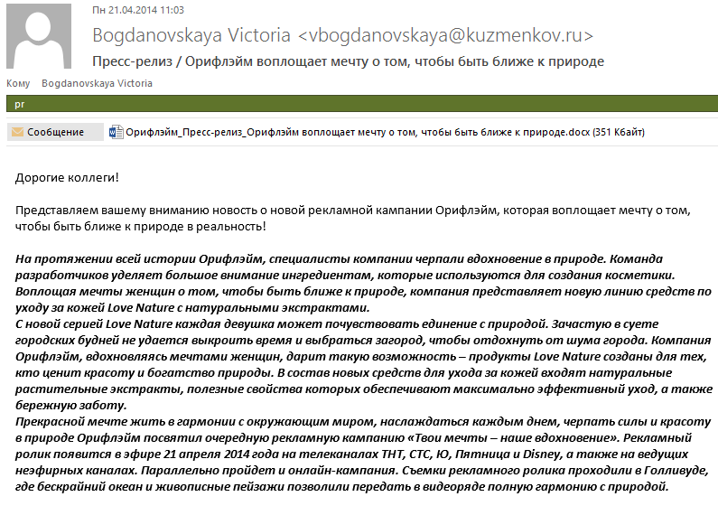
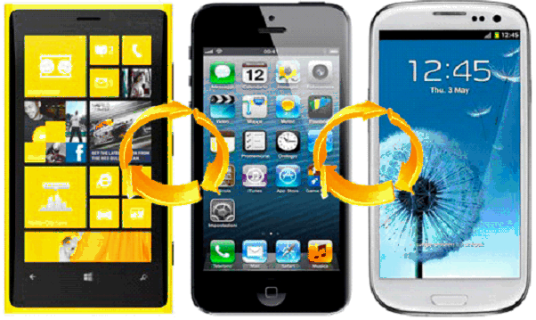

#Содержание релиза

Как писал десантник Константин Елькин, самурай без меча - то же самое, что самурай с мечом. Только без меча.

Пресс-релиз похож на новость, но формат немного отличается. В Сети можно найти десятки описаний того, как правильно писать пресс-релиз.

Все сходятся в том, что кроме заголовка и текста есть дополнительные элементы. Например, надпись "ДЛЯ НЕМЕДЛЕННОГО РАСПРОСТРАНЕНИЯ" (или противоположность - "НЕ ДЛЯ РАСПРОСТРАНЕНИЯ ДО"). Контакты пиарщика. Информация о компании. 

Если вы хотите ориентироваться на западные образцы, используйте рекомендации оформления пресс-релизов из [AP Stylebook](http://www.apstylebook.com/). Журналисты Associated Press специально завели такой раздел в своем руководстве по стилю - журналисту гораздо проще работать, когда он знает, чего ждать от пиарщика. Сам доступ к руководству платный, но интернет [усеян](http://mwpartners.com/apstyle) [выжимками](http://www.lunareclipse.net/pressrelease.htm) и [рекомендациями](http://www.wikihow.com/Format-a-Press-Release-for-the-Associated-Press).

##Отправитель

Сотрудник пресс-службы - представитель компании. Конечно, со временем журналист и пиарщик знакомятся, и журналист уже знает, от кого пришло письмо. Но формально это все равно коммуникация компании и издания.

Поэтому правильнее соблюдать некоторые простые правила.

1. Не отсылать релиз с ящика PR-специалиста - особенно если рассылка идет не на личный ящик журналиста, а на общий email издания. Название компании говорит потенциальному читателю пресс-релиза больше, чем имя автора.
2. Оставить личную переписку для случаев, когда обсуждается тот или иной пресс-релиз с совершенно определенными людьми, ответственными за информационный повод.

Еще раз - общаются издание и компания, а не журналист и пиарщик. Журналист привыкает к определенному PR-специалисту, а ведь другие могли бы помочь быстрее. Поэтому, когда пиарщик меняется, обоим приходится выстраивать отношения заново. Единая точка входа для вопросов - спасает.

##Обращение

Пиарщики вежливо приветствуют журналистов:

**Уважаемые коллеги!**

**Добрый день, дорогие друзья!**

**Уважаемые коллеги, добрый день!**

**Добрый день!**

Это не обмен любезностями. Вы связались с журналистом по делу. Он ждет краткого, информативного, даже телеграфного изложения. Важно задать темп одним-двумя словами. 

**Добрый день** или **Друзья** с запятой после обращения и сразу - с заголовком релиза - допустимы и даже желательны. Не нужно называть журналистов коллегами. Все-таки вы с ними в разных профессиональных цехах.

Не стоит доверять сочинение обращений роботу, как это сделала Microsoft со своим **Привет, подписчик!** 

Бывает лучше обойтись без приветствия. Берите пример с Opera, "Вымпелкома" и многих других крупных компаний.

##Подводка

В большинстве случаев пиарщики уточняют, что прислали релиз, а не абы что. В этом нет никакой необходимости.

Например, PR-агентство компании Орифлэйм начало один из своих релизов так:

**Представляем вашему вниманию новость о новой рекламной кампании Орифлэйм, которая воплощает мечту о том, чтобы быть ближе к природе в реальность!** (орфография сохранена)

Дальнейший текст был не лучше.

Даже если бы кто-то взялся понять, о чем идет речь в письме, ему вряд ли бы это удалось. Где-то в недрах набранного полужирным текста мелькают слова о новой линии средств по уходу за кожей - но вытащить оттуда факты в нужном журналисту порядке практически нереально.

Часто как новость, событие подают сам пресс-релиз. Возьмем самое простое - анонс продукта:

**Рады представить вам пресс-релиз, посвященный выходу на российский рынок Defender Smart Call HD2**

**Представляем вашему вниманию пресс-релиз, анонсирующий начало продаж в России умного браслета SmartBand**

**Представляем вашему вниманию пресс-релиз, анонсирующий начало продаж в России смартфона Xperia M2 Dual.**

Коммуникация пиарщика с журналистом - это деловая переписка. В ней все должно быть прекрасно - короткое приветствие, переход к делу, отсутствие трудностей для восприятия. Не лучше ли:

**В России начались продажи Defender Smart Call HD2 - смарт ТВ-приставки на базе Android**

**В России начались продажи умного браслета SmartBand**

**В России начались продажи смартфона Xperia M2 Dual**

"Представляем вашему вниманию пресс-релиз" - это мусор, шелуха. К тому моменту как журналист открыл письмо, он уже должен знать:

1. Вид сообщения (пресс-релиз, исправление, комментарий, приглашение)
2. Название компании
3. Информационный повод или хотя бы часть повода

##Начало релиза

У пресс-релизов есть стандартные, кровью и потом выработанные стандарты оформления. Благодаря им ваши релизы станут понятнее, а коммуникации станут выглядеть более профессионально.

Взгляните на примеры оформления пресс-релизов на сайтах [PR Newswire](http://www.prnewswire.com/), BusinessWire или [PRWeb](prweb.com). 

###Начните релиз с даты и места

Просто сравните:

**ЛОС АНДЖЕЛЕС, 18 июля 2019 года. Компания Skynet представляет новое поколение человекоподобных роботов**

и
**Уважаемые коллеги, позвольте представить релиз про выпуск компанией Skynet новых человекоподобных роботов**

Станьте аккуратистом - вы об этом не пожалеете.

Обычный формат вступления - место, время, источник. Иногда через две косые черты ставится средство дистрибуции. Заканчивается вступление точкой или тире (одинарным или двойным). 

**DENVER, May 1, 2014 /PRNewswire-USNewswire/ --** 

Есть формат попроще: место плюс средство дистрибуции в скобках.

**CINCINNATI--(BUSINESS WIRE)--**

Иногда после названия города упоминается страна.

**CRAWLEY, England--(BUSINESS WIRE)--**

##Качество изображений

Постарайтесь сохранять актуальность изображений в тексте пресс-релиза. Например, релиз от 30 апреля 2014 года не может содержать картинку с iPhone предыдущего поколения, работающим под управлением iOS 6 или младше.

Не лучшая идея и пересылать зернистые из-за высокого сжатия и потери цветности картинки. Журналист не сможет их использовать.

Путать пресс-релиз с рекламной брошюрой не следует. Ни одно издание в здравом уме не поставит в качестве иллюстрации к своей новости дружелюбных бизнесменов, скрепляющих сделку рукопожатием или бодрую до отвращения семью, которой помогает идти по жизни с улыбкой новая услуга вашей компании.

Иллюстрация - это суть вашего информационного повода, спрессованная в моментально узнаваемый или интересный визуальный образ. Она не может быть просто "красивенькой". Она должна дополнять ваше сообщение и помочь журналисту его понять. Хорошо, если картинка придает вашему сообщению новое измерение или рассказывает то, что на письме передать невозможно.

Есть дюжина способов рассказать о новой версии iOS, но только один способ наглядно показать ее.

##Подпись

По общему правилу подпись должна быть полезна для адресата. В ней можно указать имя и фамилию, должность, средства связи и дополнительную информацию. Некоторые (и это, пожалуй, лишнее) - дополняют ее баннерами.

Коммуникацию можно строить по-разному. Подробная подпись хороша, если предполагается, что этот человек еще не раз будет с вами общаться, либо будет именно ваши контакты искать в почтовике.

Возможно, вы не имели в виду подружить конкретного журналиста с конкретным пиарщиком. Тогда самое правильное - создать единую точку входа для общения с компанией и лишь указывать контактных лиц. Есть выражение product owner - владелец продукта, ответственный за все в нем. А людей, указанных в конкретном пресс-релизе правильно бы назвать - release owners. Именно они вам помогут. 

Смотрите, как просто и элегантно это делает Яндекс. В зависимости от ответственных имена меняются, точка входа остается прежней (письмо также приходит с pr@yandex-team.ru, спасая получателя от шизофрении).

Лучше всего, если контакты стоят рядышком с дополнительной информацией. Вот, посмотрите, как это сделано на сайте российской пресс-службы Apple. Информация о компании одновременно сопровождает и текст, и контакты.

Контакты важнее любой дополнительной информации, поэтому - если у вас есть выбор, не забывайте о них. 

Не уподобляйтесь одному европейскому банку, который подписывается **"Пресс-центр такого-то банка"**, а дальше пускает 17 (прописью - *семнадцать*) абзацев текста про себя и банковскую группу. При этом нигде в релизе нет контактных данных - кроме адреса, с которого пришло письмо.

